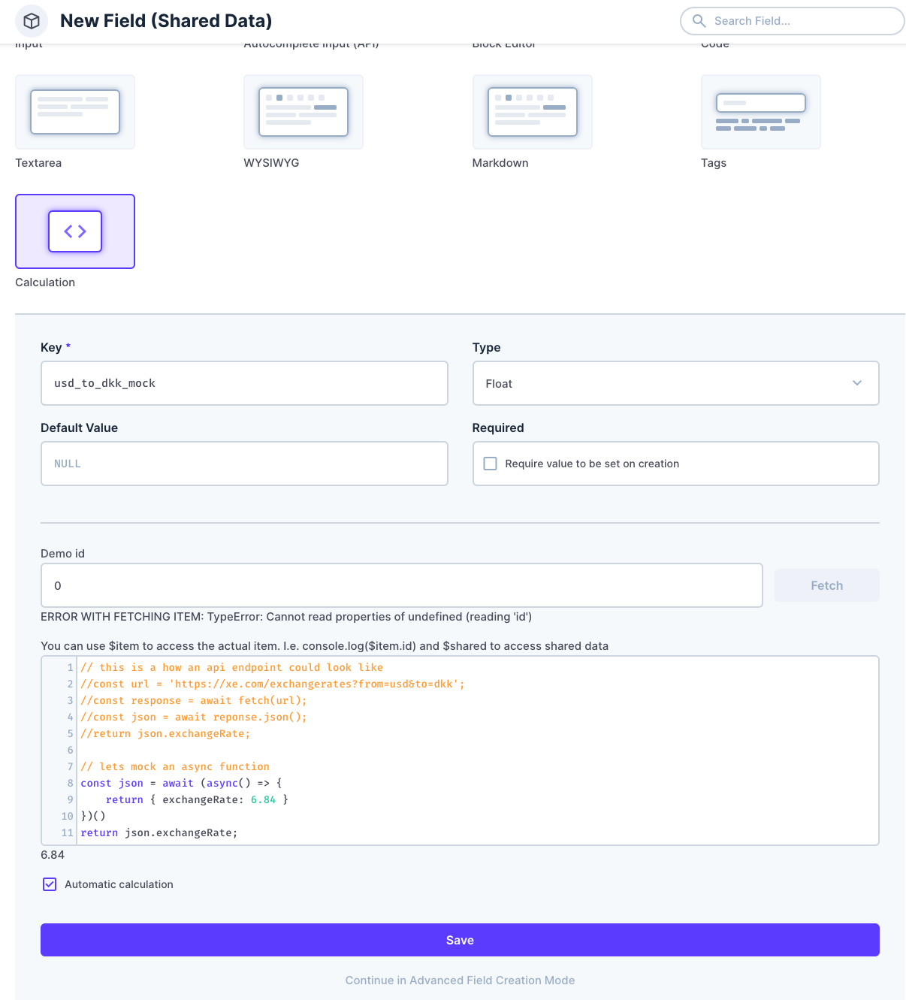
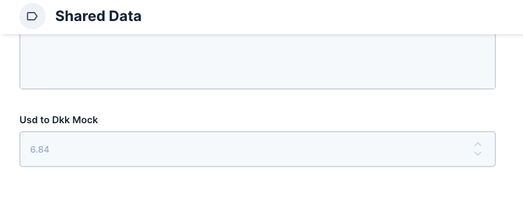
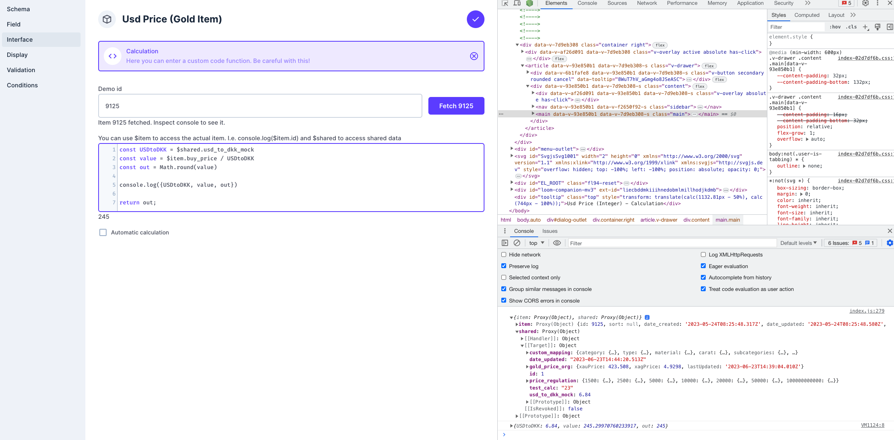

# directus-calculation-fields-extension

This is my take on calculated fields in directus (which I think is quite relevant to this [discussion](https://github.com/directus/directus/discussions/3079)).

## disclaimer

Note that this repo is probably not ready to directly plug and play into directus but is merely served as a an inspiration of how this issue could be solved. It's not an elegant solution and also a quite computational extensive solution, but it gets the job done for me right now until the community comes up with something better that hopefully will be integrated directly into directus

## description

It's a solution where we have an interface to create the custom calculation fields and then we have a custom global hook that calculates these calculations values every time an item is updated and saves these to the database. It does this through custom javascript, that is written in the interface.

The downside with the approach to only updating values on the update filter is that they are not live on the client view - unless you are in the "create interface" view. However, this was the the simplest solution I could think of.

**BE CAREFUL WHEN USING THIS PLUGIN. BECAUSE IT USES CUSTOM JS CODE YOU CAN DO A LOT OF DAMAGE. THIS IS ONLY ATTENDED TO BE ACCESSIBLE TO ADMINS THAT KNOWS WHAT THEY ARE DOING**

## interface

The interface enables you to write custom javascript code in a field which evaluates to a value which is later inserted into the database. The interface supports the following types: ['text', 'integer', 'float', 'string'].

The interface supports a boolean called `automaticCalculation`. In the attached implementation of the hook, this should always be true. The reason that I created it, was because I wanted the users' to have an option to manually overwrite the result of the calculation, such that if the value was empty, the value of the calculation would be returned, and if not it would return the actual value. This required a read hook as well, which is not included in this repo. However, this turned out not be needed for us, so I removed support for it.

Let me know, if you need to be able to do this, and I'll look into providing it.

## global hook

This project needs a global hook to make sure that the values in the database is updated when the item gets updated in directus. Furthermore a scheduled job is added to provide continous updates. This is relevant when you use outside data that changes. For instance one of our calculation fields is directly related to a currency exchange rate. The cron job makes sure that our currency is always on at maximum 24 hours old (or whatever you set the schedule to).

The way that we directly implemented this is to have a sharedItem which you can see in global item hook on line 58: `const sharedItem = await database.select().from('shared_data').first();`. This shared_data item is a singleton, that has a currency exchange rate calculation field. This is updated every 24 hours, and because this shared item is passed into the custom function, the updated currency is available in the custom javascript code.

## screenshots

This is the example with the third party api data where we retrieve some exchange rate from a third party api in our shared data. We use the name usd_to_dkk_mock

After the creation we have this in our shared data:

This data is then accessible in another collection, that uses the shared item:

On the right side in the console you see that we have the item itself available in $item and the shared item in $shared. The shared item holds our value `usd_to_dkk_mock` which we can utilize in our new calculation field in another collection.

After we're done both fields will automatically update every 24 hours (our setting) or whenever you update on of the items (this doesn't mean that both get updated. If you update shared_date the calculation fields in shared_data will be updated but not automatically the calculation fields in the other dependant collections and vice versa)
